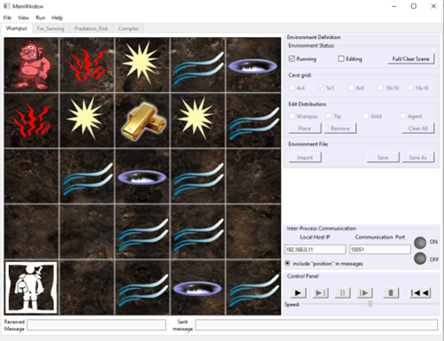

# bio-inspired-reactive-agent

O objetivo deste trabalho é desenvolver um agente para concluir uma tarefa específica em um ambiente controlado. Escolhemos um ambiente proposto por Norvig e Russel, o mundo Wumpus, amplamente usado no meio acadêmico para soluções de problemas de inteligência artificial. Um agente neste mundo virtual tem como objetivo superar predadores (Wumpus) entre outros obstáculos, a fim de alcançar recompensas. 

O agente deve seguir requisitos específicos para concluir a tarefa:
- Funcionamento descrito por uma máquina de estado finito;
- O menor uso de memória possível, sendo cada unidade de memória representada por 1 bit;
- Processos de decisão definidos por uma lógica binária;
- Lógica comportamental do agente não pode estar atrelada as características “físicas” do ambiente;
- Implementação do melhor agente desenvolvido em MEF em um agente desenvolvido em rede neural pulsada.

Trata-se, portanto, de entender e demonstrar como podemos partir de um agente com um mecanismo de processamento simples, no sentido computacional (quantidade de bits, memória e operações lógicas), para um modelo bioinspirado de agente capaz de cumprir um objetivo em um ambiente controlado.

Cada agente foi simulado 50 vezes para os ambientes 8x8, 10x10 e 16x16, totalizando 150 simulações por agente.

A simulação sempre inicia no estado i_ini, que varia de acordo com o ambiente escolhido. No jogo do mundo Wumpus este início simboliza o agente saindo de sua “gruta” e partindo em busca da recompensa. Todos os agentes foram testados nos três ambientes. A cada turno, de todas as simulações, as seguintes informações foram armazenadas a fim de se avaliar o desempenho do agente nos diferentes tipos de ambiente:
- Id do ambiente (8x8, 10x10 e 16x16);
- Id do agente;
- Id da rodada de simulação (1 a 50);
- Energia: É a quantidade de interações permitidas. Este número muda conforme o grid escolhido sendo 200 iterações para o ambiente 16x16, 100 para o ambiente 10x10, 65 para o ambiente 8x8, 25 para o ambiente 5x5 e 20 para o ambiente 4x4. Após o término da energia, a agente morre;
- Estado atual;
- Próximo estado;
- Direção escolhida (norte, sul, leste e oeste).
- Flag perseguir norte 
- Flag perseguir sul 
- Flag perseguir leste 
- Flag perseguir oeste 
- Flag recuar norte 
- Flag recuar sul 
- Flag recuar leste 
- Flag recuar oeste 

Este projeto esta organizado da seguinte forma:
- reports: notebooks de análise de comportamento e desempenho
- results: métricas de simulação
- scripts:
    - main: main do projeto, concentra a organização geral da MEF
    - config: configurações do sistema. Neste arquivo deve ser escolhido o agente e o ambiente.
    - utils: funções auxiliares
    - agent: lógica dos agentes
    - brian: lógica da rede brian
    - topology: topologia da rede brian

